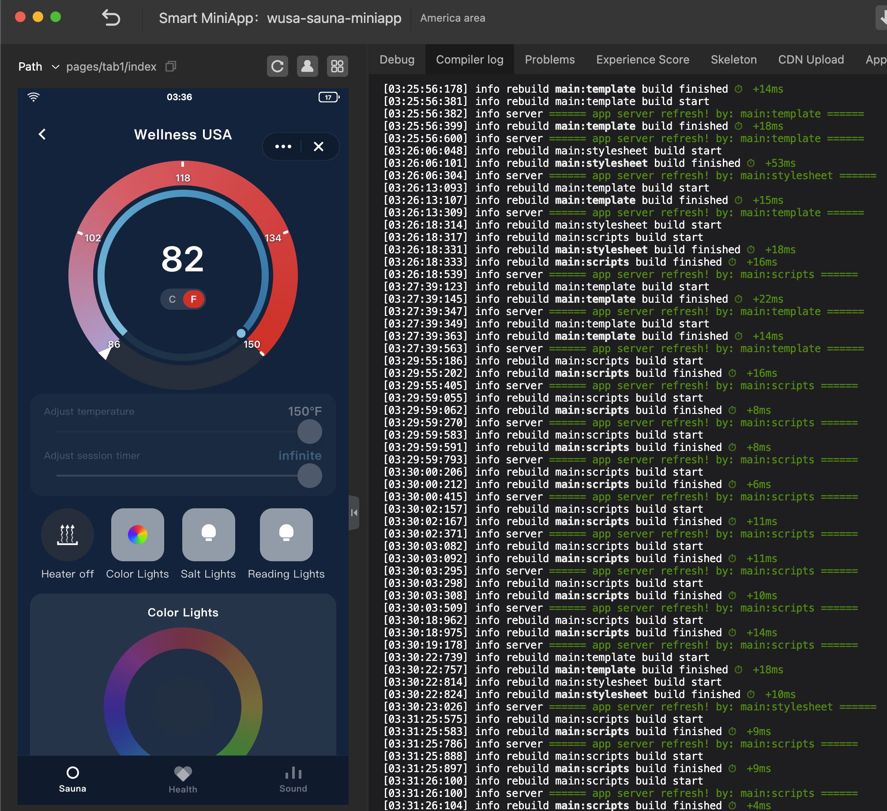

# Wellness USA Sauna MiniApp

Tuya MiniApp for the Wellness USA infrared sauna. It runs as a full Smart Life page (`compileType: miniprogram`) with a companion home-screen widget.



## Features

### Sauna

- Dual-ring temperature gauge: outer needle is current temperature, inner cyan knob is the target (86–150 °F / 30–66 °C)
- **Adjust temperature** and **Adjust session timer** sliders (timer 10–90 minutes, or infinite)
- Heater, color lights, salt lights, and reading lights
- Hue wheel and brightness for color lights
- **Shut down sauna** turns off heater and lights, and disables temperature and timer. The button is enabled only while a feature is on. Turning heater or lights back on re-enables controls.

### Health

- Heart rate and blood oxygen (session estimates)
- Calories burned for the current session
- Total sauna session runs (increments when the heater is turned on; stored locally)
- Short sauna health tips

### Sound

- Solfeggio frequency player: 174, 285, 396, 417, 528, 639, 741, 852, and 963 Hz
- Looping tones, volume control, play/stop
- Audio files live in `app/assets/audio/`

## Project layout

```
app/                      MiniApp (full page)
  pages/tab1/             Sauna, Health, and Sound tabs
  assets/audio/           Solfeggio WAV loops
  assets/images/          Heater icon and size guides
  i18n/strings.json       EN / ZH strings
widget/cards/canvas/      Home-screen widget card
project.tuya.json         Tuya project config
```

Main UI files: `app/pages/tab1/index.tyml`, `index.js`, `index.less`.

State is kept locally with `ty.setStorage` / `ty.getStorage` under the key `saunaState`. Device DPs are not wired yet.

## Requirements

- [Tuya MiniApp IDE](https://developer.tuya.com/en/miniapp/)
- Node.js with yarn or npm
- MiniKit 3.0.7, BaseKit 3.0.6, BizKit 4.2.0 (see `project.tuya.json`)

On macOS, open the IDE from `/Applications/Tuya MiniApp IDE.app`. Running it from a mounted DMG can break compiles (App Translocation).

## Get started

```shell
yarn
```

or

```shell
npm install
```

1. Open **Tuya MiniApp IDE**.
2. Import this folder.
3. Preview or compile the miniprogram (not widget-only mode).

Format source files:

```shell
npm run format
```

## Widget

`widget/cards/canvas` is a compact status card. Tap it to open the full Sauna page.

To work on the widget in the IDE, switch compile type to widget in project settings. The checked-in `project.tuya.json` uses `miniprogram` for the full app.

## Controls summary

| Control                    | Behavior                                         |
| -------------------------- | ------------------------------------------------ |
| Gauge / temperature slider | Set target temperature while the sauna is active |
| Session timer              | 10–90 min, or infinite                           |
| Heater / lights            | Independent toggles; any one on enables shutdown |
| Shut down sauna            | One-way off; greyed out when everything is off   |
| Health tab                 | Heart, SpO2, calories, session count, tips       |
| Sound tab                  | Pick a frequency and play a looping tone         |

## References

- [Tuya MiniApp docs](https://developer.tuya.com/en/miniapp/)
- [hideStatusBar](https://developer.tuya.com/en/miniapp/develop/miniapp/api/base/container/hideStatusBar.md)
- [InnerAudioContext](https://developer.tuya.com/en/miniapp/develop/miniapp/api/media/audio/createInnerAudioContext.md)

## Support

For Tuya platform issues, [submit a ticket](https://service.console.tuya.com/).

## License

See [LICENSE](LICENSE).
